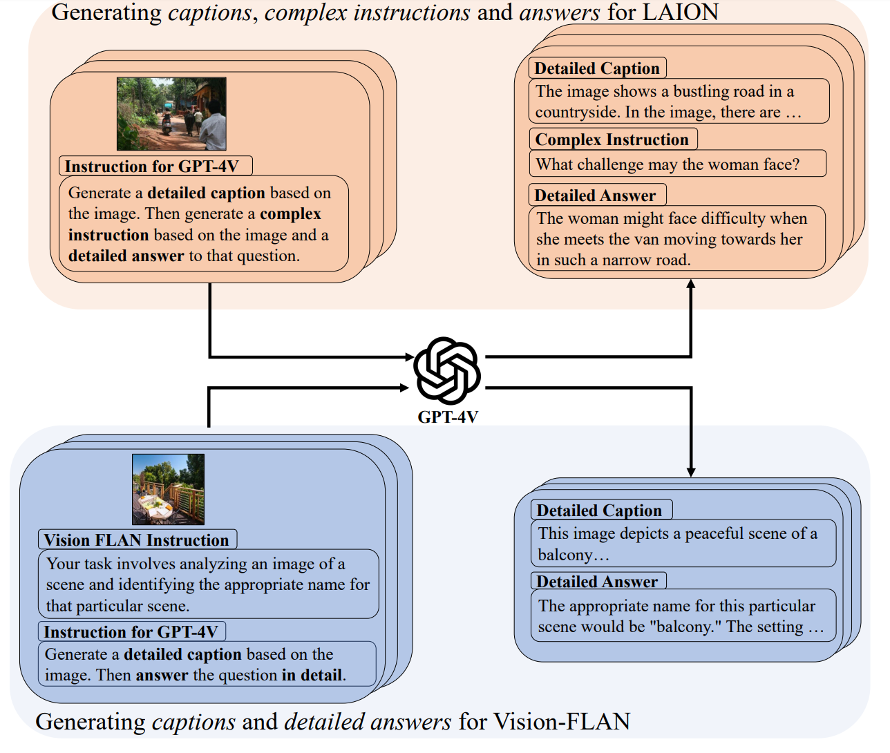

# ALLaVA: Harnessing  GPT4V-synthesized Data for A Lite Vision-Language Model


<!-- <div align=center>

</div> -->

⚡ALLaVA is a project that provides a large-scale GPT4V-synthesized  dataset for training LVLMs.⚡
<center>

   
<!--  -->
</center>

<p align="center">
   📃 <a href="https://arxiv.org/abs/2402.11684" target="_blank">Paper</a>  • 🤗 <a href="https://huggingface.co/datasets/FreedomIntelligence/ALLaVA-4V" target="_blank">HuggingFace</a>  
   <!-- <br>  <a href="https://github.com/FreedomIntelligence/CMB/blob/main/README_zh.md">   中文</a> | <a href="https://github.com/FreedomIntelligence/CMB/blob/main/README.md"> English -->
</p>

## ✨ Latest News
- [02/21/2024]: We are thrilled to release 1) **1.4M** data for training LVLMs, 2) two version of our ALLaVA-3B models, 3) inference code and 4) tech report.


## 📚 Data

### Generation Pipeline


<div align=center>

</div>


* LAION

We leverage the superb GPT-4V to generate captions and complex reasoning QA pairs. Prompt is [here](prompts/prompt_for_laion.txt).

* Vison-FLAN

We leverage the superb GPT-4V to generate captions and detailed answer for the original instructions.  Prompt is [here](
prompts/prompt_for_vflan.txt).

* Wizard

We regenerate the answer of Wizard_evol_instruct with GPT-4-Turbo.

### Dataset Cards

All datasets can be found [here](https://huggingface.co/datasets/FreedomIntelligence/ALLaVA-4V).

| Name | #Samples | Image Source | Instruction Source | Answer Source |
| --- | ---: | ---: | ---: | ---: | 
|ALLaVA-Caption-LAION-4V* | 512,843 | LAION (web) | [Handcrafted](prompts/instructions_for_captions.txt) | GPT-4V
|ALLaVA-Caption-VFLAN-4V**| 512,843 | [Vision FLAN](https://huggingface.co/datasets/Vision-Flan/vision-flan_191-task_1k/tree/main) | [Handcrafted](prompts/instructions_for_captions.txt) | GPT-4V
|ALLaVA-Instruct-LAION-4V* | 202,552 | LAION (web) | GPT-4V | GPT-4V
|ALLaVA-Instruct-VFLAN-4V**| 203,065 | [Vision FLAN](https://huggingface.co/datasets/Vision-Flan/vision-flan_191-task_1k/tree/main) | [Vision FLAN](https://huggingface.co/datasets/Vision-Flan/vision-flan_191-task_1k/tree/main) *** | GPT-4V
Evol-Instruct-GPT4-Turbo-143K |143,000 | / | [Wizard](https://huggingface.co/datasets/WizardLM/WizardLM_evol_instruct_V2_196k) | GPT-4-Turbo

**ALLaVA-Caption-LAION-4V* and *ALLaVA-Instruct-LAION-4V* share the same set of images.

***ALLaVA-Caption-VFLAN-4V* and *ALLaVA-Instruct-VFLAN-4V* share the same set of images. 

***In *ALLaVA-Caption-VFLAN-4V* and *ALLaVA-Instruct-VFLAN-4V*, we additionally include 30K samples which are distilled following the same manner for LAION (i.e. Distilling Captions and Complex Reasoning QA pairs). We mix them up with the other data whose instructions are from the original VFLAN.

### Sample Demonstration
* ALLaVA-Caption-LAION-4V
```
{
  "id": "allava_laion_cap_1",
  "conversations": [
    {
      "from": "human",
      "value": "<image>\nHow does the inclusion of gemstones affect the overall aesthetic and possible value of the ring?"
    },
    {
      "from": "gpt",
      "value": "The inclusion of gemstones along the edges of the leaf design enhances the ring's aesthetic by adding a touch of brilliance and luxury. The small, clear gemstones catch the light, creating a sparkling effect that contrasts with the silver's polished surface and the leaf's textured details. This sparkling accent likely increases the ring's visual appeal, making it stand out more as an accessory. In terms of value, the presence of gemstones, which could be diamonds, would likely raise the ring's monetary worth. Gemstones, especially diamonds, are prized for their beauty and durability, and their addition to jewelry pieces often signifies a higher quality and class of the item, thereby increasing its market value."
    }
  ],
  "original_caption": "190952cz Pandora Tropical Palm Leaf Ring",
  "url": "https://theartofpandora.com/wp-content/uploads/2016/10/190952CZ-1-600x600.jpg"
}
  ```

* ALLaVA-Caption-VFLAN-4V
```
{
  "id": "allava_vflan_cap_100000",
  "image": "allava_vflan/images/images_191task_1k/PACS+guitar_image_category_classification_830_n03272010_10795-5.png",
  "conversations": [
    {
      "from": "human",
      "value": "<image>\nHow would you describe the image to someone who cannot see it?"
    },
    {
      "from": "gpt",
      "value": "The image shows a simplistic line drawing of an electric guitar. The guitar is oriented diagonally from the top left corner to the bottom right corner of the image. It has a long, narrow neck with tuning pegs at the top, resembling a stylized \"T\" shape. The body of the guitar is irregular, with two cutaways on either side of the neck, giving it an asymmetric appearance. The body is also characterized by sharp angles rather than curves, which is not typical for most guitars. There are four horizontal lines across the body, likely representing strings. The drawing is black and white, with no shading or color, and appears to be hand-drawn with a single continuous line without much detail. The background is plain and white."
    }
  ]
}
```

* ALLaVA-Instruct-LAION-4V

```
{
  "id": "allava_laion_inst_1",
  "conversations": [
    {
      "from": "human",
      "value": "<image>\nHow does the inclusion of gemstones affect the overall aesthetic and possible value of the ring?"
    },
    {
      "from": "gpt",
      "value": "The inclusion of gemstones along the edges of the leaf design enhances the ring's aesthetic by adding a touch of brilliance and luxury. The small, clear gemstones catch the light, creating a sparkling effect that contrasts with the silver's polished surface and the leaf's textured details. This sparkling accent likely increases the ring's visual appeal, making it stand out more as an accessory. In terms of value, the presence of gemstones, which could be diamonds, would likely raise the ring's monetary worth. Gemstones, especially diamonds, are prized for their beauty and durability, and their addition to jewelry pieces often signifies a higher quality and class of the item, thereby increasing its market value."
    }
  ],
  "original_caption": "190952cz Pandora Tropical Palm Leaf Ring",
  "url": "https://theartofpandora.com/wp-content/uploads/2016/10/190952CZ-1-600x600.jpg"
}
```

* ALLaVA-Instruct-VFLAN-4V
```
{
  "id": "allava_vflan_inst_9",
  "image": "allava_vflan/images/images_191task_1k/VQA-E+visual_question_answering_574_COCO_train2014_000000119456.jpg",
  "conversations": [
    {
      "from": "human",
      "value": "<image>\nYou are provided with an image and a question related to the image. Answer the question based on the information given in the image.\n\nIs bigfoot in the picture?"
    },
    {
      "from": "gpt",
      "value": "The creature in the image is not Bigfoot, also known as Sasquatch. Bigfoot is typically described in folklore and cryptozoology as a large, bipedal humanoid creature with ape-like features, standing upwards of 6 to 9 feet tall. The animal present in the photograph is quadrupedal, possesses a body structure similar to that of a pig, and has features such as long hair and tusks, which are characteristic of a wild boar. Additionally, there is no evidence of bipedal creatures or any human-like figures that would suggest the presence of Bigfoot. The setting and visual clues do not align with the commonly reported sightings of Bigfoot, which often describe it as a solitary figure standing upright among trees. Therefore, based on the visual information available in the image, the conclusion is that Bigfoot is not depicted here."
    }
  ]
}
```


## 🏭 Inference

### Setup

* Clone the directory and install basic requirements
```shell
git clone https://github.com/FreedomIntelligence/ALLaVA.git
cd ALLaVA
pip install -r requirements.txt
```

* [Install Flash Attention (with a cuda device)](https://github.com/Dao-AILab/flash-attention?tab=readme-ov-file#installation-and-features)


### CLI
```
python allava/serve/cli.py --model_dir /path/to/allava/dir
```


### Batch Inference
Will be implemented soon! For now, please use the `bot.chat()` API in `allava/serve/cli.py`  to perform generation. Don't forget to call `bot.clear_history()` after generation for each item in a dataset. An example code snippet is shown below:

```python
bot = Chatbot(config)
data = [item1, item2]
responses = []
for line in data:
    text = line['text'] # str
    image = line['image'] # either PIL.Image.Image or path to a LOCAL image

    response = bot.chat(text=text, images=image)

    responses.append(response)

    bot.clear_history() # start fresh for a new item

```


## 🏋️‍♂️ Training

### Code
The training code is largely based on [LLaVA](https://github.com/haotian-liu/LLaVA). 
We wholeheartedly express our gratitude for their invaluable contributions to open-sourcing LVLMs.

### Cost
We train our models on 8*A800 GPUs.
[ALLaVA-3B](https://huggingface.co/FreedomIntelligence/ALLaVA-3B) takes 8.3h for PT and 10.6h for FT.
[ALLaVA-3B-Longer](https://huggingface.co/FreedomIntelligence/ALLaVA-3B-Longer) takes 8.3h for PT and 21.3h for FT.
These two models share the same PT procedure.


### Hyperparameters

| Global Batch Size| ZeRO Stage| Optimizer | Max LR| Min LR | Scheduler| Epochs | Max length | Weight decay |
| ---: | ---: |--:| ---: | ---: | ---: | ---: | ---: | ---: |
| 256 (PT) / 128 (FT) | 1| AdamW | 2e-5 | 2e-6 | CosineAnnealingWarmRestarts| 1 | 2048 | 0 |

The LM backbone, projector are trainable, while the vision encoder is kept frozen. 
**The trainabilities of each module are the same for both stages.**


## 🙌 Contributors
Project Leader: [Guiming Hardy Chen](https://g-h-chen.github.io/)

Data: Shunian Chen, [Junying Chen](https://jymchen.github.io/), Xiangbo Wu

Evaluation: [Ruifei Zhang](https://scholar.google.com/citations?user=W4zOhmEAAAAJ&hl=zh-CN)

Deployment: Xiangbo Wu, Zhiyi Zhang

Advising: [Zhihong Chen](https://zhjohnchan.github.io/), [Benyou Wang](https://wabyking.github.io/old.html)

Others: Jianquan Li, [Xiang Wan](https://scholar.google.com/citations?user=e3_kWigAAAAJ&hl=zh-CN)


## 📝 Citation
If you find our data useful, please consider citing our work! We are FreedomIntelligence from [Shenzhen Research Institute of Big Data](http://sribd.cn/en) and [The Chinese University of Hong Kong, Shenzhen](https://sds.cuhk.edu.cn/en)
```
@misc{chen2024allava,
      title={ALLaVA: Harnessing GPT4V-synthesized Data for A Lite Vision-Language Model}, 
      author={Guiming Hardy Chen and Shunian Chen and Ruifei Zhang and Junying Chen and Xiangbo Wu and Zhiyi Zhang and Zhihong Chen and Jianquan Li and Xiang Wan and Benyou Wang},
      year={2024},
      eprint={2402.11684},
      archivePrefix={arXiv},
      primaryClass={cs.CL}
}
```
