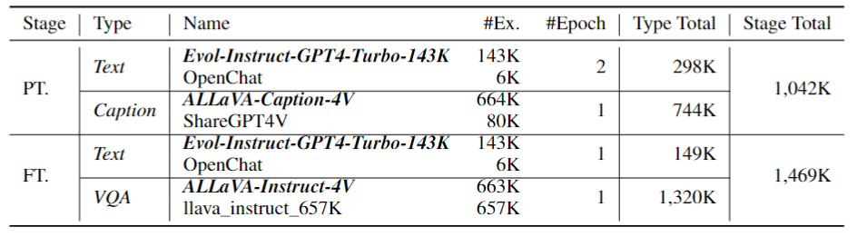

# ALLaVA: Harnessing  GPT4V-synthesized Data for A Lite Vision-Language Model


<!-- <div align=center>

</div> -->

<p align="center">
‚ö°ALLaVA is a project that provides a large-scale GPT4V-synthesized  dataset for training LVLMs.‚ö°
</p>

<!-- <p align="center">

   
</p> -->

<p align="center">
    
    
    
</p>

<p align="center">
   📃 <a href="https://arxiv.org/abs/2402.11684" target="_blank">Paper</a>  • 🌐 <a href="https://allava.freedomai.cn/#/" target="_blank">Demo</a> 
</p>
<p align="center">
   🤗 <a href="https://huggingface.co/datasets/FreedomIntelligence/ALLaVA-4V" target="_blank">ALLaVA-4V Dataset</a> 
</p>
   
<p align="center">
   🤗 <a href="https://huggingface.co/FreedomIntelligence/ALLaVA-Phi3-mini-128k" target="_blank">ALLaVA-Phi3-mini-128k</a> 
   • 🤗 <a href="https://huggingface.co/FreedomIntelligence/ALLaVA-StableLM2-1_6B" target="_blank">ALLaVA-StableLM2-1_6B</a>
   • 🤗 <a href="https://huggingface.co/FreedomIntelligence/ALLaVA-Phi2-2_7B" target="_blank">ALLaVA-Phi2-2_7B</a> 
</p>

<!-- <p align="center">
   📃 <a href="https://arxiv.org/abs/2402.11684" target="_blank">Paper</a>  • 🌐 <a href="https://allava.freedomai.cn/#/" target="_blank">Demo</a> • 🤗 <a href="https://huggingface.co/datasets/FreedomIntelligence/ALLaVA-4V" target="_blank">ALLaVA-4V Dataset</a> • 🤗 <a href="https://huggingface.co/FreedomIntelligence/ALLaVA-3B-Longer" target="_blank">ALLaVA-3B-Longer</a> • 🤗 <a href="https://huggingface.co/FreedomIntelligence/ALLaVA-3B" target="_blank">ALLaVA-3B</a>
    <br>  <a href="https://github.com/FreedomIntelligence/CMB/blob/main/README_zh.md">   中文</a> | <a href="https://github.com/FreedomIntelligence/CMB/blob/main/README.md"> English
</p> -->

## ‚ú® Updates
- [06/25/2024]: We release [ALLaVA-Phi3-mini-128k](https://huggingface.co/FreedomIntelligence/ALLaVA-Phi3-mini-128k), [ALLaVA-StableLM2-1_6B](https://huggingface.co/FreedomIntelligence/ALLaVA-StableLM2-1_6B), [ALLaVA-Phi2-2_7B](https://huggingface.co/FreedomIntelligence/ALLaVA-Phi2-2_7B) which all support loading from 🤗 repo.
- [03/01/2024]: The huggingface repo of **ALLaVA-3B-Longer (recommended)** and ALLaVA-3B are updated, which now supports the `from_pretrained` method to load models.
- [02/29/2024]: The huggingface repo of ALLaVA-4V dataset and [download scripts](#data-preparation) are updated. 
- [02/21/2024]: We are thrilled to release 1) **1.4M** data for training LVLMs, 2) two version of our ALLaVA-3B models, 3) inference code and 4) tech report.


## üìö ALLaVA-4V Data

### Generation Pipeline


<div align=center>

</div>


* LAION

We leverage the superb GPT-4V to generate captions and complex reasoning QA pairs. Prompt is [here](prompts/prompt_for_laion.txt).

* Vison-FLAN

We leverage the superb GPT-4V to generate captions and detailed answer for the original instructions.  Prompt is [here](
prompts/prompt_for_vflan.txt).

* Wizard

We regenerate the answer of Wizard_evol_instruct with GPT-4-Turbo.

### Dataset Cards
All datasets can be found [here](https://huggingface.co/datasets/FreedomIntelligence/ALLaVA-4V).
The structure of naming is shown below:
```bash
ALLaVA-4V
├── ALLaVA-Caption-4V
│   ├── ALLaVA-Caption-LAION-4V
│   └── ALLaVA-Caption-VFLAN-4V
├── ALLaVA-Instruct-4V
│   ├── ALLaVA-Instruct-LAION-4V
│   └── ALLaVA-Instruct-VFLAN-4V
├── Evol-Instruct-GPT4-Turbo-143K
```

The folder structure of the huggingface dataset space:
```bash
ALLaVA-4V
├── allava_laion/
│   ├── ALLaVA-Caption-LAION-4V.json
│   ├── ALLaVA-Instruct-LAION-4V.json
|   └── images.zip 
├── allava_vflan/
│   ├── ALLaVA-Caption-VFLAN-4V.json
│   └── ALLaVA-Instruct-VFLAN-4V.json
├── allava_text/
│   └── Evol-Instruct-GPT4-Turbo-143K.json
```
**We do NOT own right to any image contained within the "images.zip" file. We collate the images and upload this file in request of the community to facilitate the data preparation process.**

Here we provide detailed information of each subset.

| Name | #Samples | Image Source | Instruction Source | Answer Source |
| --- | ---: | ---: | ---: | ---: | 
|ALLaVA-Caption-LAION-4V* | 505,588 | LAION (web) | [Handcrafted](prompts/instructions_for_captions.txt) | GPT-4V
|ALLaVA-Caption-VFLAN-4V**| 202,552 | [Vision FLAN](https://huggingface.co/datasets/Vision-Flan/vision-flan_191-task_1k/tree/main) | [Handcrafted](prompts/instructions_for_captions.txt) | GPT-4V
|ALLaVA-Instruct-LAION-4V* | 505,588 | LAION (web) | GPT-4V | GPT-4V
|ALLaVA-Instruct-VFLAN-4V**| 203,065 | [Vision FLAN](https://huggingface.co/datasets/Vision-Flan/vision-flan_191-task_1k/tree/main) | [Vision FLAN](https://huggingface.co/datasets/Vision-Flan/vision-flan_191-task_1k/tree/main) *** | GPT-4V
Evol-Instruct-GPT4-Turbo-143K |143,000 | / | [Wizard](https://huggingface.co/datasets/WizardLM/WizardLM_evol_instruct_V2_196k) | GPT-4-Turbo

**ALLaVA-Caption-LAION-4V* and *ALLaVA-Instruct-LAION-4V* share the same set of images.

***ALLaVA-Caption-VFLAN-4V* and *ALLaVA-Instruct-VFLAN-4V* share the same set of images. 

***In *ALLaVA-Caption-VFLAN-4V* and *ALLaVA-Instruct-VFLAN-4V*, we additionally include 30K samples which are distilled following the same manner for LAION (i.e. Distilling Captions and Complex Reasoning QA pairs). We mix them up with the other data whose instructions are from the original VFLAN.


### Data Preparation

#### LAION

Specify the `laion_root` in `./download/download_laion.sh` and run 
```shell
sh ./download/download_laion.sh
```
<!-- Specify the input and output paths in `./download/laion/download_laion.sh` and simply run
```shell
sh ./download/laion/laion.sh
```
to start downloading images from URLs in the annotation files. As a reference, downloading 512K images takes ~10 hours with 200 threads and a maximum bandwidth of 3MB/s. The outputs of running this script are:

- successfully downloaded images (binary files)

- captions in conversation format with local image paths (json)

- instructions in conversation format with local image paths (json) -->


#### VFLAN
Specify the `vflan_root` in `./download/download_vflan.sh` and run 
```shell
sh ./download/download_vflan.sh
```


#### Evol-Instruct-GPT4-Turbo-143K
Specify the `text_root` in `./download/download_text.sh` and run 
```shell
sh ./download/download_text.sh
```


### Sample Demonstration
<details><summary>ALLaVA-Caption-LAION-4V</summary>

```
{
  "id": "allava_laion_cap_100277305",
  "image": "allava_laion/images/100277305.jpeg",
  "conversations": [
    {
      "from": "human",
      "value": "<image>\nPlease depict the image in words."
    },
    {
      "from": "gpt",
      "value": "The image displays a silver ring with a design that resembles a stylized leaf. The leaf design is split into two symmetrical halves, separated by a gap that runs along the ring's band. Each half of the leaf pattern is textured with detailed, vein-like striations that give it a realistic look. The edges of the leaf design are embellished with small, clear gemstones that could possibly be diamonds, adding a sparkle to the ring. The band of the ring is wide, supporting the large leaf motif, and it tapers slightly as it moves away from the leaf design. The silver metal has a high polish, reflecting light brightly and providing a contrast to the textured leaf surface. The craftsmanship suggests a mix of organic inspiration with a touch of elegance due to the gems
tone accents."
    }
  ],
  "original_caption": "190952cz Pandora Tropical Palm Leaf Ring",
  "url": "https://theartofpandora.com/wp-content/uploads/2016/10/190952CZ-1-600x600.jpg"
}
  ```
</details>


<details><summary>ALLaVA-Caption-VFLAN-4V</summary>

```
{
  "id": "allava_vflan_cap_100000",
  "image": "allava_vflan/images/images_191task_1k/PACS+guitar_image_category_classification_830_n03272010_10795-5.png",
  "conversations": [
    {
      "from": "human",
      "value": "<image>\nHow would you describe the image to someone who cannot see it?"
    },
    {
      "from": "gpt",
      "value": "The image shows a simplistic line drawing of an electric guitar. The guitar is oriented diagonally from the top left corner to the bottom right corner of the image. It has a long, narrow neck with tuning pegs at the top, resembling a stylized \"T\" shape. The body of the guitar is irregular, with two cutaways on either side of the neck, giving it an asymmetric appearance. The body is also characterized by sharp angles rather than curves, which is not typical for most guitars. There are four horizontal lines across the body, likely representing strings. The drawing is black and white, with no shading or color, and appears to be hand-drawn with a single continuous line without much detail. The background is plain and white."
    }
  ]
}
```
</details>

<details><summary>ALLaVA-Instruct-LAION-4V</summary>

```
{
  "id": "allava_laion_inst_100277305",
  "image": "allava_laion/images/100277305.jpeg",
  "conversations": [
    {
      "from": "human",
      "value": "<image>\nHow does the inclusion of gemstones affect the overall aesthetic and possible value of the ring?"
    },
    {
      "from": "gpt",
      "value": "The inclusion of gemstones along the edges of the leaf design enhances the ring's aesthetic by adding a touch of brilliance and luxury. The small, clear gemstones catch the light, creating a sparkling effect that contrasts with the silver's polished surface and the leaf's textured details. This sparkling accent likely increases the ring's visual appeal, making it stand out more as an accessory. In terms of value, the presence of gemstones, which could be diamonds, would likely raise the ring's monetary worth. Gemstones, especially diamonds, are prized for their beauty and durability, and their addition to jewelry pieces often signifies a higher quality and class of the item, thereby increasing its market value."
    }
  ],
  "original_caption": "190952cz Pandora Tropical Palm Leaf Ring",
  "url": "https://theartofpandora.com/wp-content/uploads/2016/10/190952CZ-1-600x600.jpg"
}
```
</details>


<details><summary>ALLaVA-Instruct-VFLAN-4V</summary>

```
{
  "id": "allava_vflan_inst_9",
  "image": "allava_vflan/images/images_191task_1k/VQA-E+visual_question_answering_574_COCO_train2014_000000119456.jpg",
  "conversations": [
    {
      "from": "human",
      "value": "<image>\nYou are provided with an image and a question related to the image. Answer the question based on the information given in the image.\n\nIs bigfoot in the picture?"
    },
    {
      "from": "gpt",
      "value": "The creature in the image is not Bigfoot, also known as Sasquatch. Bigfoot is typically described in folklore and cryptozoology as a large, bipedal humanoid creature with ape-like features, standing upwards of 6 to 9 feet tall. The animal present in the photograph is quadrupedal, possesses a body structure similar to that of a pig, and has features such as long hair and tusks, which are characteristic of a wild boar. Additionally, there is no evidence of bipedal creatures or any human-like figures that would suggest the presence of Bigfoot. The setting and visual clues do not align with the commonly reported sightings of Bigfoot, which often describe it as a solitary figure standing upright among trees. Therefore, based on the visual information available in the image, the conclusion is that Bigfoot is not depicted here."
    }
  ]
}
```
</details>

<details><summary>Evol-Instruct-GPT4-Turbo-143K</summary>

```
{
  "idx": "heR0vZB",
  "conversations": [
    {
      "from": "human",
      "value": "As an online platform teacher named Aimee, you possess impeccable credentials which include a Bachelor of Science degree in Industrial and Labor Relations from Cornell University, expertise in the English language, and intermediate proficiency in both Chinese and Spanish. Additionally, your professional experience as a STEAM teacher at UN Women in Singapore has honed your skills in teaching children from the ages of 6-11 and working with students from all levels of education. Your exceptional teaching abilities in spoken English and pronunciation paired with your personal strengths of being informed, patient, and engaging make you an ideal teacher for students seeking to improve their English language skills. Can you provide a short, concise, and unique English self-introduction in bullet point form that would attract students to enroll in your course?"
    },
    {
      "from": "gpt",
      "value": "Sure, here are some bullet points for your English self-introduction:\n\n- Hi there! My name is Aimee and I'm thrilled to be your online English teacher!\n- With a Bachelor's degree from Cornell University and experience teaching STEAM at UN Women in Singapore, I know how to help students learn effectively.\n- I'm passionate about language and have intermediate proficiency in both Chinese and Spanish, so I understand the challenges of learning a new language.\n- In my classes, I focus on improving spoken English and pronunciation, as well as building vocabulary and grammar skills.\n- But learning English doesn't have to be boring! I'm an engaging and patient teacher who loves to have fun and make learning enjoyable.\n- So, whether you're a beginner or an advanced student, I'm confident that I can help you improve your English skills and achieve your goals. Let's get started!"
    }
  ]
}
```
</details>

## Benchmark Result

Our models [**ALLaVA-Phi3-mini-128k**](https://huggingface.co/FreedomIntelligence/ALLaVA-Phi3-mini-128k), 
[**ALLaVA-StableLM2-1_6B**](https://huggingface.co/FreedomIntelligence/ALLaVA-StableLM2-1_6B) 
and [**ALLaVA-Phi2-2_7B**](https://huggingface.co/FreedomIntelligence/ALLaVA-Phi2-2_7B) 
achieve competitive results on 17 benchmarks. 


|      Models        | Vicuna-80 | GQA | HallusionBench | MME-P | MMVP | TouchStone | TextVQA | MME-C | MathVista | MM-Vet | MMMU-val | SQA (img) | LLaVA (In-the-Wild) | MLLM-Bench | MMB-en | MMB-cn | SEEDBench (img, v1) |
|---------------------------|-----------|-----|-------|-------|------|----|---------|-------|----|--------|-----------------|---------|---------------|----|--------|--------|--------------------|
| **Large VLMs**           |           |     |       |       |      |    |         |       |    |        |                 |         |               |    |        |        |                    |
| BLIP-2                   | -         | -   | -     | -     | -    | -  | -       | -     | -  | 22.4   | 34.4            | -       | -             | 3.0*| -      | -      | 49.7              |
| InstructBLIP             | -         | 49.5| -     | -     | -    | -  | -       | -     | -  | 25.6   | -               | -       | 58.2          | -   | 44.0   | -      | -                 |
| Qwen-VL-Chat             | -         | 57.5| -     | 1487.6| -    | -  | 61.5    | 360.7 | -  | 31.1   | -               | 68.2    | -             | -   | 60.6   | 56.7   | 65.4               |
| LLaVA-1.5-7B             | 13.8*     | 62.0| 36.6* | 1504.4*| 24.7*| 594.9*| 58.2| 324.6*| 25.0*| 31.1| 35.1*| 66.8| 65.4| 23.0*| 64.3| 58.3| 66.1|
| LLaVA-1.5-13B            | 22.5      | 63.3| 36.5* | 1531.3 | 38.0*| 617.7*| 61.3| 295.4| 28.3*| 35.4| 34.4*| 71.6| 72.5| -| 67.7| 63.6| 68.2|
| LVIS-7B                  | -         | 62.6| -     | -     | -    | -  | 58.7    | -     | -  | 31.5   | -               | -       | 67.0          | 29.0*| 66.2   | -      | -                 |
| LVIS-13B                 | -         | 63.6*| -    | -     | -    | -  | 62.5*   | -     | -  | 37.4*  | -               | -       | 71.3*         | -   | 68.0*  | -      | -                 |
| ShareGPT4V-7B            | 13.8*     | 63.3| 36.0* | 1540.1*| 34.0*| 637.2*| 60.4| 346.1*| 24.7*| 37.6| 35.4*| 68.4*| 72.6| 30.2*| 68.8| 61.0*| 69.7|
| ShareGPT4V-13B           | 17.5*     | 64.8| 39.0* | 1576.1*| 35.3*| 648.7*| 62.2| 309.3*| 28.8*| 43.1| 35.6*| 70.0*| 79.9| 35.5*| 71.2| 61.7*| 70.8|
| **4B-scale Lite VLMs**   |           |     |       |       |      |    |         |       |    |        |                 |         |               |    |        |        |                    |
| MobileVLM-v2             | 5.0*      | 61.1| 30.8* | 1440.5 | 18.7*| 541.0*| 57.5| 261.8*| 28.3*| 26.1*| 30.8*| 70.0| 53.2*| 15.7*| 63.2| 43.2*| 64.5*|
| Mipha-3B                 | 16.2*     | **63.9**| 34.3*| **1488.9**| 32.0*| 619.0*| 56.6| 285.0*| 27.8*| 33.5*| 35.8*| 70.9| 64.7*| 23.1*| **69.7**| 42.9*| **71.2***|
| TinyLLaVA                | 15.6*     | 62.1| 37.2* | 1465.5*| 33.3*| 663.5*| **60.3**| 281.1*| 30.3*| 37.5| 38.4| **73.0**| 70.8*| 29.8*| **69.7***| 42.8*| 70.4*|
| **Ours**                 |           |     |       |       |      |    |         |       |    |        |                 |         |               |    |        |        |                    |
| **ALLaVA-Phi2**          | 49.4      | 48.8| 24.8  | 1316.2| **36.0**| 632.0| 49.5| 301.8| 27.4| 32.2| 35.3| 67.6| 69.4| 43.6| 64.0| 40.8| 65.2|
| **ALLaVA-StableLM2**     | 38.8      | 49.8| 25.3  | 1311.7| 34.0 | 655.2| 51.7| 257.9| 27.7| 31.7| 33.3| 64.7| **72.0**| 39.3| 64.6| 49.8| 65.7|
| **ALLaVA-Phi3**          | **56.9**| 52.2| **48.1**| 1382.3| 32.7| **667.8**| 53.0| **347.1**| **32.9**| **37.8**| **41.1**| 64.0| 68.5| **54.8**| 68.1| **55.3**| 69.0|


> \* denotes the results of our evaluation. **Bold numbers** are the best results among all 4B-scale LVLMs.The detailed information of each benchmark is shown in Table 4 of our [technical report](https://arxiv.org/pdf/2402.11684.pdf).

## üè≠ Inference
All models can be loaded from HuggingFace using `.from_pretrained()` method.
Check out [example scripts]() for sample inputs and outputs.


<!-- ### Load from 🤗 (Recommended) 
See the [example script](allava/serve/huggingface_inference.py). -->

<!-- ### CLI

```shell
git clone https://github.com/FreedomIntelligence/ALLaVA.git
cd ALLaVA
pip install -r requirements.txt

python allava/serve/cli.py --model_dir /path/to/allava/model
``` -->

<!-- ### Setup

* Clone the directory and install basic requirements
```shell
```

* [Install Flash Attention (with a cuda device)](https://github.com/Dao-AILab/flash-attention?tab=readme-ov-file#installation-and-features)


### CLI -->


<!-- ### Batch Inference -->
<!-- You can use the `bot.chat()` API in `allava/serve/cli.py`  to perform generation. Don't forget to call `bot.clear_history()` after generation for each item in a dataset. An example code snippet is shown below:

```python
bot = Chatbot(config)
data = [item1, item2]
responses = []
for line in data:
    text = line['text'] # str
    image = line['image'] # either PIL.Image.Image or path to a LOCAL image

    response = bot.chat(text=text, images=image)

    responses.append(response)

    bot.clear_history() # start fresh for a new item
``` -->


## 🏋️‍♂️ Training

### Data
<!-- <div align=center>

</div> -->

As shown in the table, ALLaVA-3B uses 1M and 1.5M data for PT. and FT., respectively. 
ALLaVA-3B-Longer trains one more epoch (i.e. 3M in total) for the FT. stage.

### Code
The training code is largely based on [LLaVA](https://github.com/haotian-liu/LLaVA). 
We wholeheartedly express our gratitude for their invaluable contributions to open-sourcing LVLMs.

### Cost
We train our models on 8*A800 GPUs.
[ALLaVA-3B](https://huggingface.co/FreedomIntelligence/ALLaVA-3B) takes 8.3h for PT and 10.6h for FT.
[ALLaVA-3B-Longer](https://huggingface.co/FreedomIntelligence/ALLaVA-3B-Longer) takes 8.3h for PT and 21.3h for FT.
These two models share the same PT procedure.


### Hyperparameters

| Global Batch Size| ZeRO Stage| Optimizer | Max LR| Min LR | Scheduler | Weight decay |
| ---: | ---: |--:| ---: | ---: | ---: | ---: |
| 256 (PT) / 128 (FT) | 1| AdamW | 2e-5 | 2e-6 | CosineAnnealingWarmRestarts | 0 |

The LM backbone, projector are trainable, while the vision encoder is kept frozen. 
**The trainabilities of each module are the same for both stages.**


## üôå Contributors
Project Leader: [Guiming Hardy Chen](https://g-h-chen.github.io/)

Data: Shunian Chen, [Junying Chen](https://jymchen.github.io/), Xiangbo Wu

Evaluation: [Ruifei Zhang](https://scholar.google.com/citations?user=W4zOhmEAAAAJ&hl=zh-CN)

Deployment: Xiangbo Wu, Zhiyi Zhang

Advising: [Zhihong Chen](https://zhjohnchan.github.io/), [Benyou Wang](https://wabyking.github.io/old.html)

Others: Jianquan Li, [Xiang Wan](https://scholar.google.com/citations?user=e3_kWigAAAAJ&hl=zh-CN)


## üìù Citation
If you find our data useful, please consider citing our work! We are FreedomIntelligence from [Shenzhen Research Institute of Big Data](http://sribd.cn/en) and [The Chinese University of Hong Kong, Shenzhen](https://sds.cuhk.edu.cn/en)
```
@misc{chen2024allava,
      title={ALLaVA: Harnessing GPT4V-synthesized Data for A Lite Vision-Language Model}, 
      author={Guiming Hardy Chen and Shunian Chen and Ruifei Zhang and Junying Chen and Xiangbo Wu and Zhiyi Zhang and Zhihong Chen and Jianquan Li and Xiang Wan and Benyou Wang},
      year={2024},
      eprint={2402.11684},
      archivePrefix={arXiv},
      primaryClass={cs.CL}
}
```

## Star History

[](https://star-history.com/#FreedomIntelligence/ALLaVA&Date)
